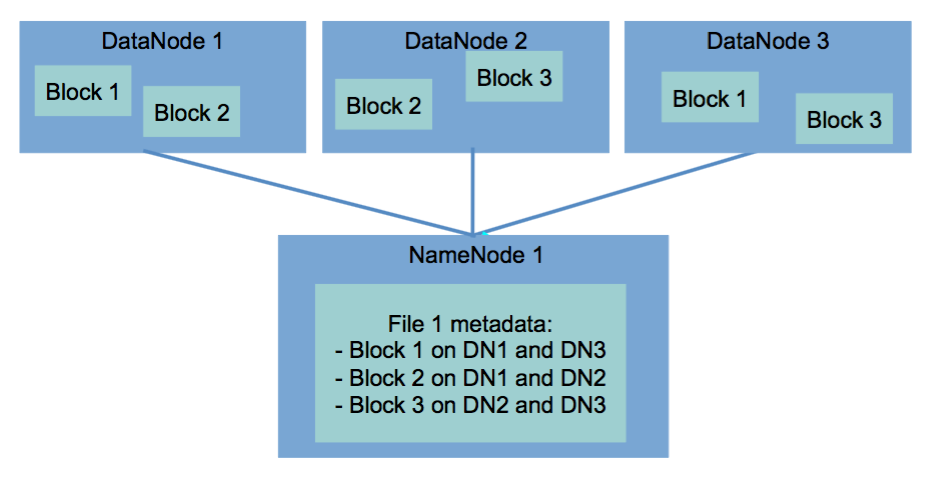
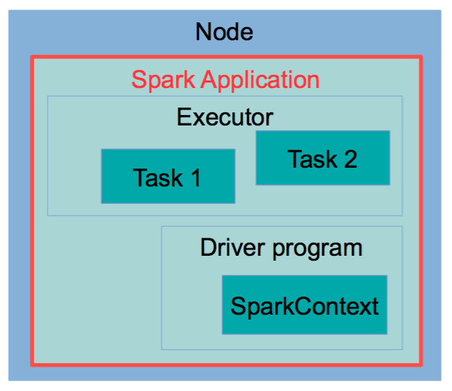
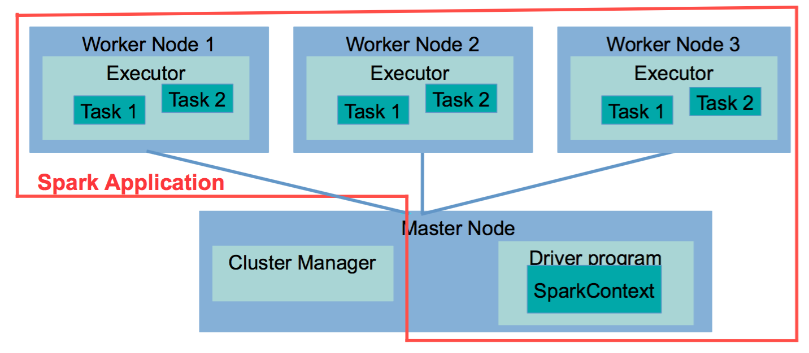

# Big data analysis

## Challenges 

* Reading and writing distributed datasets
* Preserving data in the presence of failing data nodes
* Supporting the execution of MapReduce tasks
* Being fault-tolerant (compute nodes)
* Coordinating the execution of tasks across a cluster

## HDFS

HDFS is the core of Hadoop. It's a fault tolerant file system that has been explicitly defined to span many computers.

The block size of HDFS is 128MB. Reasons:

* Reduced need for memory to store metadata
* Reduced need for seek operations in big files
* Efficient when most data of a block have to be processed
* More efficient use of the network (less number of connectons)

## Spark

### Why spark

* Hadoop can only perform relatively simple jobs on large dataets.
* Complex jobs are performed -> caching data in memory and finer-grained control on execution of jobs

### Spark runtime Architecture  

#### Spark components:  
* Driver program: the main logic of the application
* Task: a single operation on dataset
* Executors: the JVM in which tasks are executed
* Cluster Manager: the process assigning tasks to workers
* Spark application: the driver program + executors
  
#### Local mode  

Every component runs within the same JVM.  
  
  
  
#### Cluster mode  
In cluster mode, every component, including the driver program, is executed on the cluster; hence, upon launching, the job can run autonomously. This is the common way of running ==non-interactive Spark jobs==.  
  
  

#### Client mode  
In client mode, the driver program talks directly to the executors on the worker nodes. Therefore, the machine hosting the driver program has to be connected to the cluster until job completion. Client mode must be used when the applications are interactive, as happens in the R, Python or Scala Spark shells.  
  
  
  
### Introducing to RDD  
  
RDDs are the way data is stored in Spark during computation.  
  
* Reliable ( data are stored redundantly, hence a failing node would not affect their integrity)
* Distributed ( data are split into chunks, and these chunks are sent to different nodes)
* Dataset ( a dataset is just a collection of objects hence very generic)  
  
#### Property of RDDs  
  
* RDDs are immutable, once defined, they cannot be changed.
* RDDs are transient, they are meant to be used only once, then discarded
*  RDDs are lazily-evaluated, the evaluation process happens only when data are to be written out of Spark, not when they are transformed into another RDD
