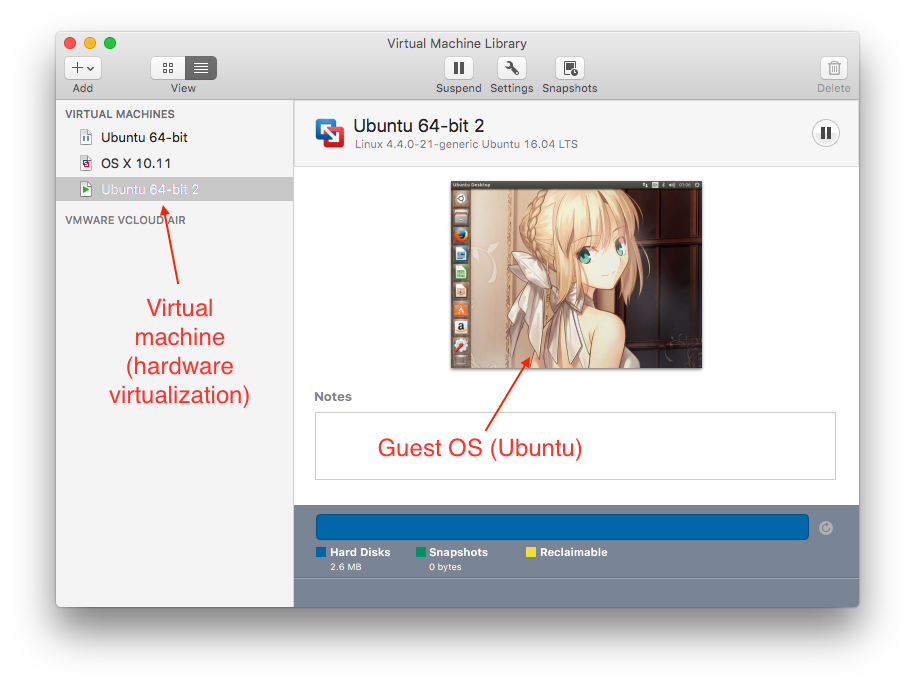
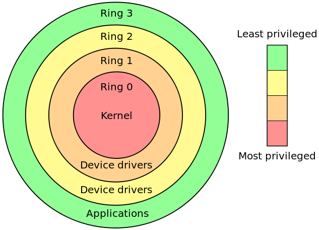
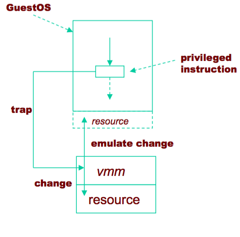
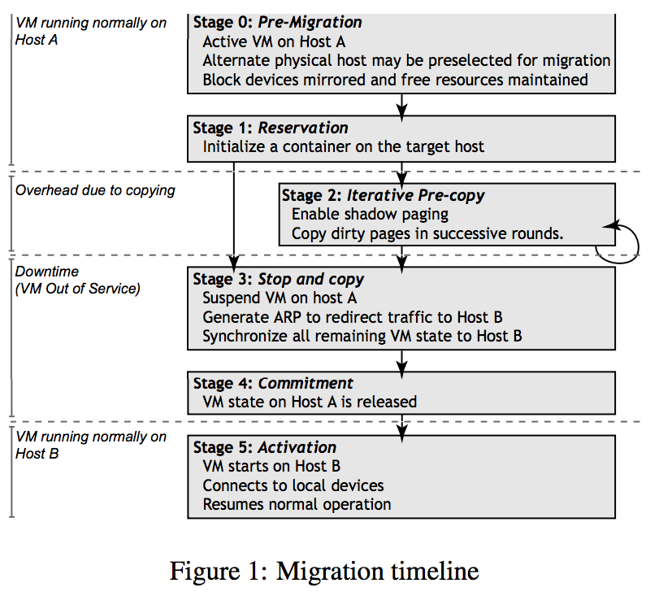
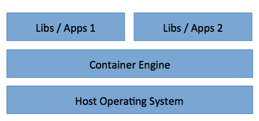

# Virtualization

## Terminology

* Virtual machine monitor / Hypervisor   
	The virtualisation layer between the underlying hardware (e.g. the physical server) and the virtual machines and guest operating systems it supports.
	* The environment of the VM should appear to be the same as the physical machine
	* Minor ==decrease in performance only==
	* Appears as though in control of system resources

* Virtual Machine: A ==representation of a real machine== using hardware/software that can host a guest operating system.
* Guest Operating System: An operating system that runs in a virtual machine environment that would otherwise run directly on a separate physical system.

*The user interface of a HMM (VMWare Fusion)*

## Background Knowledge

### Processor modes
A processor in a computer running a typical OS has two different modes: user mode and kernel mode. The processor switches between the two modes depending on what type of code is running on the processor. Applications run in user mode, and core operating system components run in kernel mode. While many drivers run in kernel mode, some drivers may run in user mode.

#### Kernel Mode

In Kernel mode, the executing code ==has complete and unrestricted access to the underlying hardware==. It can execute **any** CPU instruction and reference **any memory address**. Kernel mode is generally reserved for the lowest-level, most trusted functions of the operating system. Crashes in kernel mode are catastrophic; they will ==halt the entire PC==.

#### User Mode

In User mode, the executing code has ==no ability to directly access hardware or reference memory==. Code running in user mode must ==delegate to system APIs to access hardware or memory==. Due to the protection afforded by this sort of isolation, crashes in user mode are always recoverable. Most of the code running on your computer will execute in user mode.

---

### Protection rings (Privilege rings)

Computer operating systems provide different levels of access to resources. A protection ring is one of two or more hierarchical levels or layers of privilege within the architecture of a computer system. This is generally hardware-enforced by some CPU architectures that provide different ==CPU modes== at the hardware or microcode level. Rings are arranged in a hierarchy from most privileged (most trusted, usually numbered zero) to least privileged (least trusted, usually with the highest ring number). On most operating systems, ==Ring 0 is the level with the most privileges and interacts most directly with the physical hardware such as the CPU and memory==.

---

### Classification of instructions

> 'Instructions' means CPU instructions. Please see assembly language to learn more about instructions. [Here is the instrction set of x86](https://en.wikipedia.org/wiki/X86_instruction_listings).

* Privileged Instructions:   
	instructions that trap if the processor is in user mode and do not trap in kernel mode.
* Sensitive Instructions:    
	instructions whose behaviour depends on the mode or configuration of the hardware. Different behaviours depending on whether in user or kernel mode.
* __Innocuous__ Instructions: instructions that are neither privileged nor sensitive –  Read data, add numbers etc.

#### Intel Privileged and Sensitive Instructions (optional)

The Intel architecture defines "privileged" instructions and "sensitive" instructions. The privileged instructions may ==only be executed when the Current Privilege Level is zero (CPL = 0)==. Attempting to execute a privileged instruction when CPL != 0 ==will generate a general protection (GP) exception==. Windows traps GP exceptions caused by executing privileged instructions and usually generates an application error. 

The sensitive instructions (also called IOPL-sensitive) may only be executed when CPL <= IOPL (I/O Privilege Level). Attempting to execute a sensitive instruction when CPL > IOPL will generate a GP exception. This should usually not cause a fatal error. The Windows Virtual Machine Manager ==(VMM) traps GP exceptions caused by executing sensitive instructions and (depending on the instruction) either simulates the instruction's behavior in the VM in which the instruction was executed, or dispaches it to a virtual device driver, which simulates the instruction's behavior== (trap and emulate). 

---

### Popek and Goldberg Theorem

For any conventional third-generation computer, an effective VMM may be constructed if the set of sensitive instructions for that computer is a subset of the set of privileged instructions.

> Some architectures, like the non-hardware-assisted x86, do not meet these conditions, so they cannot be virtualized in the classic way. But architectures can still be fully virtualized (in the x86 case meaning at the CPU and MMU level) by using different techniques like _binary translation_, which replaces the sensitive instructions that do not generate traps, which are sometimes called critical instructions.

## Properties of interest

There are three properties of interest when analyzing the environment created by a VMM.

* Equivalence / Fidelity   
	A program running under the VMM should exhibit a behavior essentially identical to that demonstrated when running on an equivalent machine directly.
* Resource control / Safety   
	The VMM must be in complete control of the virtualized resources.
* Efficiency / Performance   
	A statistically dominant fraction of machine instructions must be executed without VMM intervention.
	
## Typical virtualization strategy

Trap-and-emulate

### VMM needs to support:

* De-privileging   
	* VMM emulates the effect on system/hardware resources of privileged instructions whose execution traps into the VMM. aka trap-and-emulate.
	* Typically achieved by running GuestOS at a lower hardware priority level than the VMM.
* Primary/shadow structures
	* VMM maintains “shadow” copies of critical structures whose “primary” versions are manipulated by the GuestOS, e.g. memory page tables.
	* Primary copies needed to insure correct versions are visible to GuestOS.
* Memory traces
	* Controlling access to memory so that the shadow
and primary structure remain coherent
	* Common strategy: write-protect primary copies so that update operations cause page faults which can be caught, interpreted, and addressed

## Aspects of VMMs

### Full virtualization vs Para-virtualization

#### Full virtualization:

In full virtualization, the virtual machine simulates enough hardware to allow an unmodified "guest" OS (one designed for the same instruction set) to be run in isolation. 

* Advantages: 
	* Guest is unaware it is executing within a VM –  Guest OS need not be modified
	* No hardware or OS assistance required
	* Can run legacy OS
* Disadvantages:
	* Can be less efficient

#### Para-virtualization

In paravirtualization, the virtual machine does not necessarily simulate hardware, but instead (or in addition) offers a special API that can only be used by modifying the "guest" OS.

* Advantages:
	* Lower virtualisation overheads, so better performance
* Disadvantages:
	* Need to modify guest OS
	* Can’t run arbitrary OS! –  Less portable
	* Less compatibility

> Because the guest OS needs to be modified, usually this kind of virtualization only support to run open source OSes as guest OSes. That's why XEN based VPS providers, such as Linode, only support Linux.

### Hardware-assisted virtualization vs binary translation

#### Hardware-assisted virtualization

In hardware-assisted virtualization, the hardware provides architectural support that facilitates building a virtual machine monitor and allows guest OSes to be run in isolation.

*	New processors typically have this
*	Requires that all sensitive instructions trappable

* Advantages:
	* Good performance
	* Easier to implement
	* Advanced implementation supports hardware assisted DMA, memory virtualisation.
* Disadvantages:
	* Needs hardware support

#### Binary translation

Trap and execute occurs by scanning guest instruction stream and replacing sensitive instructions with emulated code.

* Advantages:
	* Guest OS need not be modified
	* No hardware or OS assistance required
	* Can run legacy OS
* Disadvantages:
	* Overheads
	* Complicated
	* Need to replace instructions “on-the- fly”

### Bare Metal Hypervisor vs Hosted Virtualisation

Bare Metal Hypervisor – VMM runs directly on actual hardware (e.g. VMWare ESX Server)

Hosted Virtualisation – VMM runs on top of another operating system

### Operating System Level Virtualisation

Also called **"containers"**. The kernel of an operating system allows the existence of multiple ==isolated user-space instances==, instead of just one.

## Memory Virtualization

## Live Migration

* Stage 0: Pre-Migration We begin with an active VM on
physical host A. To speed any future migration, a target
host may be preselected where the resources required
to receive migration will be guaranteed.
* Stage 1: Reservation A request is issued to migrate an OS
from host A to host B. We initially confirm that the
necessary resources are available on B and reserve a
VM container of that size. Failure to secure resources
here means that the VM simply continues to run on A
unaffected.
* Stage 2: Iterative Pre-Copy During the first iteration, all
pages are transferred from A to B. Subsequent iterations
copy only those pages dirtied during the previous
transfer phase.
* Stage 3: Stop-and-Copy We suspend the running OS instance
at A and redirect its network traffic to B. As
described earlier, CPU state and any remaining inconsistent
memory pages are then transferred. At the end
of this stage there is a consistent suspended copy of
the VM at both A and B. The copy at A is still considered
to be primary and is resumed in case of failure.
* Stage 4: Commitment Host B indicates to A that it has
successfully received a consistent OS image. Host A
acknowledges this message as commitment of the migration
transaction: host A may now discard the original
VM, and host B becomes the primary host.
* Stage 5: Activation The migrated VM on B is now activated.
Post-migration code runs to reattach device
drivers to the new machine and advertise moved IP
addresses.

[Live Migration of Virtual Machines](https://www.usenix.org/legacy/event/nsdi05/tech/full_papers/clark/clark.pdf)

## Further Reading

[
Know the Difference between VMWare, KVM, OpenVZ, Xen, Virtuozzo](http://kb.enterprisevpssolutions.com/know-the-difference-between-vmware-kvm-openvz-xen-virtuozzo/)

# Linux Containers

Problems of virtualization: cost resources. The cost in terms of disk and RAM of replicating an entire operating system can be huge.

*Virtualization architecture*

*Containerization architecture*

## VM vs Containers

## When to use containers? Why are containers important?

If you have to run many applications on the same machine, it is
simpler to keep them separated in different containers.

Containers offer a way to ==isolate applications and related libraries/configurations from each other==. This is important because upgrading a single library can cause incompatibilities to appear in apparently unrelated applications.

## Docker

* Docker is by far the most successful containerization technology to date.
* It uses the Linux kernel (notably cgroups), and LXC technology.
* Docker containers run slightly slower than native processes.